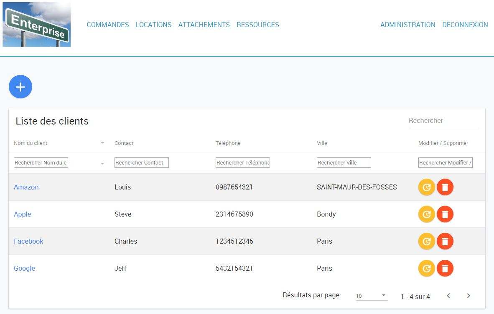
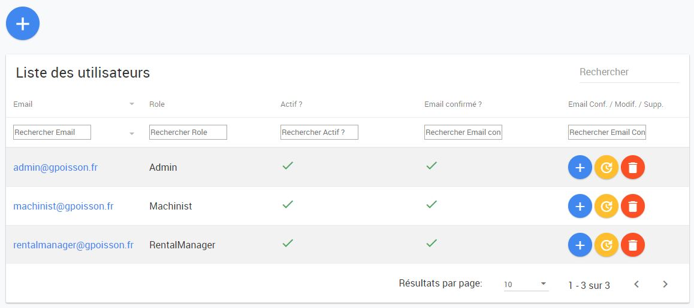
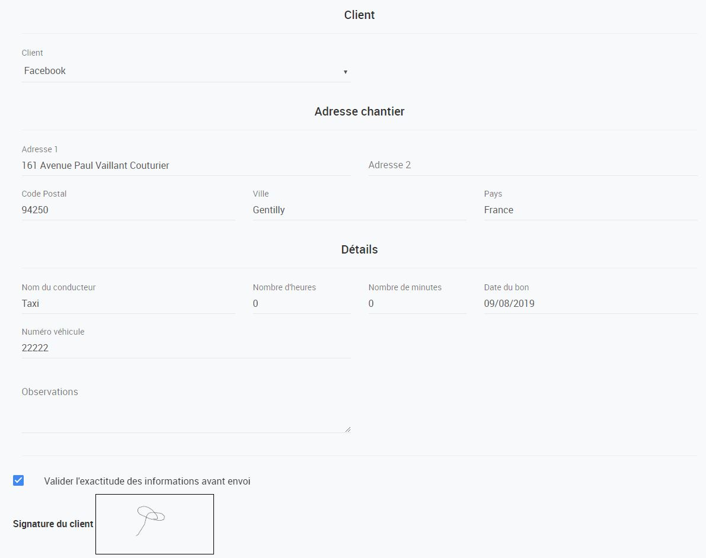
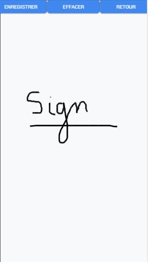

# MachineRental

## Industrial Machine Rental Manager Tool
 
 

### Specifications
* C# 4.7.2

* ASP.NET MV5

* Entity Framework 6 (Code First Approach)

* Javascript/JQuery

### Screenshots

#### Datatable Customer :

#### Administration page :

#### Attachment Form :

#### Canvas for signature by screen touch :

